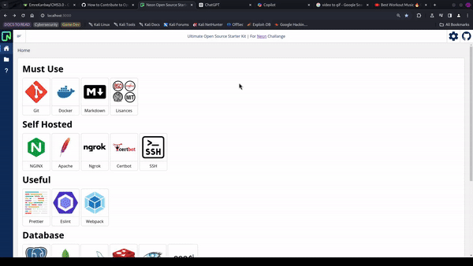

# Ultimate Open Source Starter Kit | for Neon

> Author: Zayd al-Muqaddim al-Qamar al-‘Aarabi




## What is this app?

- This app is a single UI for cheat sheets of most used frameworks and most used tools for Open Source Softwares
- You can find boilerplate codes and most used commands for the tools you use often


## How to initialize app

https://github.com/user-attachments/assets/c1e4bbee-c1e3-4bdd-87fc-94421b58f19d


## How to Start:


1. clone this repository 

```bash
git clone https://github.com/EmreKanbay/Open-Source-Starter-Kit.git
```
2. Change directroy into the folder 

```bash
cd Open-Source-Starter-Kit
```
3. Initialize the code 

```bash 
npm i
```

4. Start the app 

```bash
node ./src
```

5. You can find app in `http://localhost:3000`
6. Enter your connection string, video above shows hot to get that string. [You can get it here](https://console.neon.tech)
7. Set your username and password


#### Tech Stack Used(For Contributers):

Frontend: Vanilla JS
Backend: Node JS - Express JS
Database: Postgres
